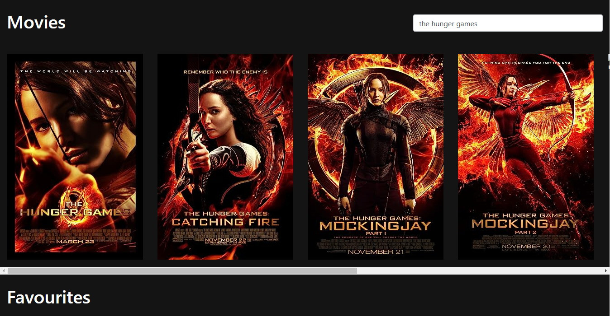

# Movie App

## Description

A REACT app that retrieves movies from the OMDB website using its API.
Users can search for movies and suggestions will appear as they type. Movies can be added or removed from a user's favourites. The favourites will be stored locally so that when the app refreshes, they will be retained.

## Installation

To run the project use one of the following commands:
    
    npm run start
or 
    
    yarn run start

## Technologies used

- React
- Bootstrap
- OMDB API
